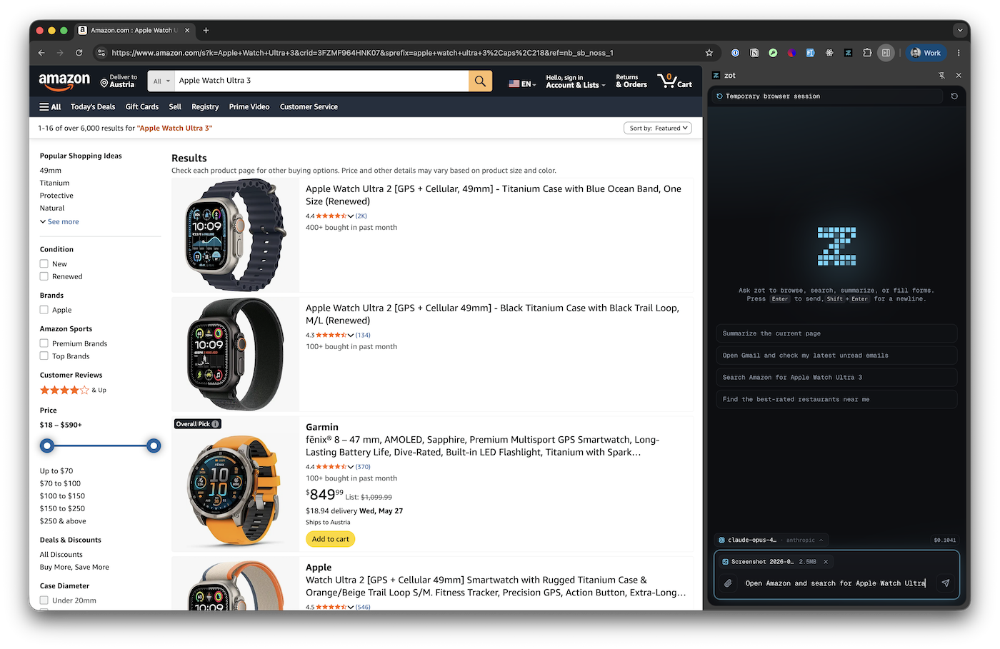

# zot-chrome-operator

Chrome extension + local bridge for chatting with zot from a Chrome side panel and letting [zot](https://www.zot.sh) operate browser tabs through a `browser_action` tool.



## Install

Install directly as a zot extension, then install the `zot-chrome` command shim:

```bash
zot ext install https://github.com/patriceckhart/zot-chrome-operator
node "$HOME/Library/Application Support/zot/extensions/zot-chrome-operator/bin/install-cli.js"
```

This does not require any changes to zot. The second command creates a global `zot-chrome` shim at:

```text
~/.local/bin/zot-chrome
```

Make sure `~/.local/bin` is on your `PATH`. For example, add this to your shell profile if needed:

```bash
export PATH="$HOME/.local/bin:$PATH"
```

Why the second command? `zot ext install` only clones/copies extension files; it does not execute install hooks. The shim is also refreshed automatically the next time zot starts normally, but running `install-cli.js` makes `zot-chrome` available immediately.

After installation, `zot-chrome` should be available from any directory:

```bash
zot-chrome status
```

## Install the Chrome extension

Build the unpacked Chrome extension and print its path:

```bash
zot-chrome ext
```

The first run installs npm dependencies and builds the unpacked extension if needed. The command prints a path ending in `dist`, for example:

```text
/Users/you/Library/Application Support/zot/extensions/zot-chrome-operator/dist
```

Then install it in Chrome:

1. Open `chrome://extensions`.
2. Enable **Developer mode** in the top-right corner.
3. Click **Load unpacked**.
4. Select the printed `dist` directory.
5. Pin the `zot` extension if you want quick access.
6. Click the extension icon to open the side panel.

After updates, run `zot-chrome ext` again if needed, then click the reload button for the unpacked extension on `chrome://extensions`.

## Run the bridge

```bash
zot-chrome start
zot-chrome status
zot-chrome logs
zot-chrome stop
```

`zot-chrome start` ensures the Chrome extension is built, then starts the local bridge in the background. The bridge starts `zot rpc --no-session` with the bundled zot extension. The Chrome side panel connects to `ws://localhost:9224` and executes browser actions requested by zot.

Optional environment:

```bash
ZOT_PROVIDER=anthropic ZOT_MODEL=claude-sonnet-4-5 zot-chrome start
PORT=9225 zot-chrome start
```

## Commands

```bash
zot-chrome start    # start the bridge server in the background
zot-chrome stop     # stop the bridge server
zot-chrome status   # check bridge state
zot-chrome logs     # tail bridge logs
zot-chrome ext      # print/build the unpacked Chrome extension path
```

## Browser capabilities

The registered zot tool can:

- list, create, switch, and close tabs
- inspect page context
- navigate
- click
- type into native and rich editors
- select options
- scroll
- extract page text
- wait

No chat session is persisted; the bridge uses zot `--no-session`.

## License

MIT
